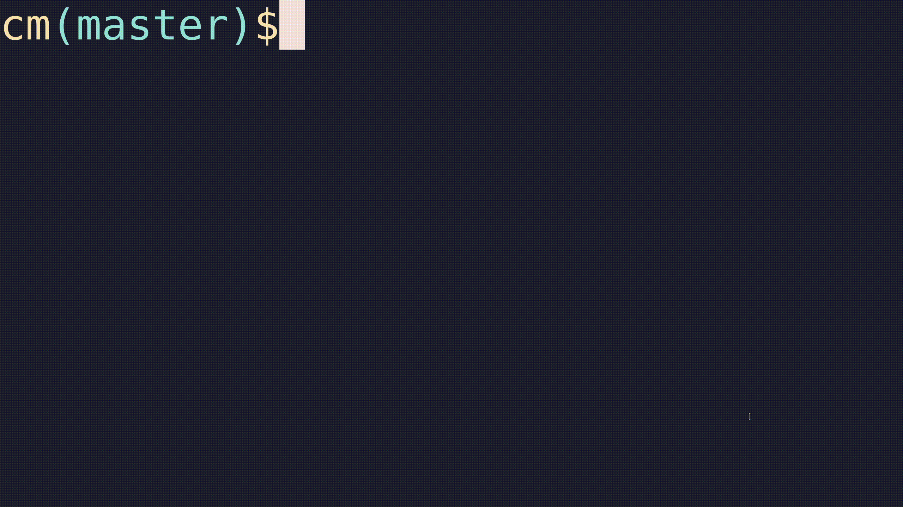

# What Is This

This is a very simple library to print out to the terminal as if it was being typed by a keyboard. Time span of every key (or string!) is left to the programmer. An example csv and a test/test.c file is given so you can see how to use this library. Currently there is support for utf8 but the program internally does not parse utf8, it just copies bytes.

# Building

to build a shared object .so and static .a file of the library for linking do
´make all´

to build the test.c and test and see the example do
´make test´

# Linking

For linking you can use the flag -lcm_tlp with compilers such as gcc and clang, make sure the directory that has the library is in the search path for libraries.

# Test Executable

You can test out the test executable while you are in the same directory as the Makefile, run:
´./build/test example.csv´

# Future Plans

I might add a randomized human like type generator for given strings but not much more unless there is a request for it. However adding human like randomized typing is not a promise since it needs utf8 parsing for basically every system I plan to support. Even though I have another project that does utf8 parsing, I might be too lazy to transfer over the functions.
